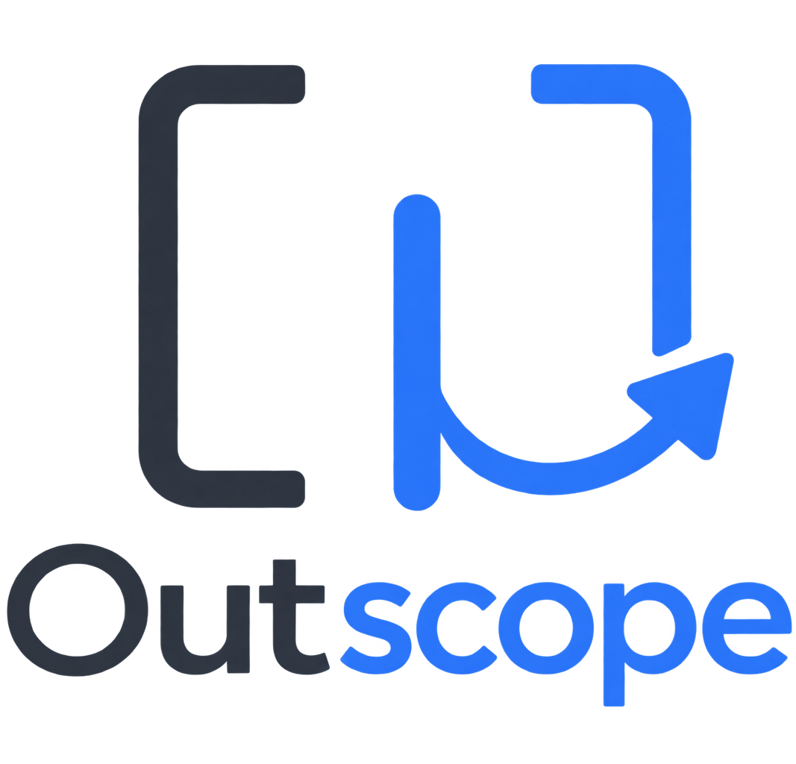

<div align="center">
  

  <h1>Outscope</h1>

  <p><strong>중첩된 JavaScript/TypeScript 문법을 한 번에, 안전하게 빠져나오세요.</strong></p>
  <p>Escape nested JavaScript and TypeScript syntax with one smart command.</p>

  <p>
    
    
    <a href="./LICENSE"></a>
  </p>
</div>

---

Outscope는 자동으로 생성된 따옴표와 괄호 안쪽에서 코드를 작성한 뒤, 바깥 문법 경계로 커서를 이동시켜 주는 VS Code 확장입니다.

닫는 문자를 여러 번 입력하거나 방향키를 반복해서 누를 필요 없이 **`Alt+Enter`** 한 번이면 됩니다. 단순히 오른쪽의 괄호 문자를 찾는 대신 TypeScript AST와 Scanner로 현재 문법 구조를 분석하기 때문에, 의미 있는 코드가 남아 있으면 그 앞에서 안전하게 멈춥니다.

## 동작 예시

`|`는 현재 커서 위치입니다.

### 중첩된 호출, 객체, 배열

Before:

```ts
foo({
  bar: [
    "hello|"
  ]
})
```

`Alt+Enter` 실행 후:

```ts
foo({
  bar: [
    "hello"
  ]
})|
```

### 의미 있는 코드 앞에서는 멈춤

```ts
foo(bar("hello|"), baz)
```

결과:

```ts
foo(bar("hello")|, baz)
```

`, baz`는 다음 인자이므로 바깥쪽 `foo()`까지 넘어가지 않습니다.

```ts
const result = foo(["hello|"]);
```

결과:

```ts
const result = foo(["hello"])|;
```

세미콜론은 닫힘 문법이 아니므로 넘지 않습니다.

### Template Literal

```ts
const value = `hello ${foo("world|")}`;
```

결과:

```ts
const value = `hello ${foo("world")}`|;
```

템플릿에 실제 내용이 남아 있다면 내부 표현식까지만 이동합니다.

```ts
const value = `hello ${foo("world")|} test`;
```

### JSX / TSX

```tsx
<Panel value={format("hello|")} />
```

결과:

```tsx
<Panel value={format("hello")} />|
```

JSX expression의 `}`, 태그의 `>`, self-closing `/>`, 일치하는 닫는 태그와 Fragment를 AST 문맥 안에서만 처리합니다.

## 주요 기능

| 기능 | 설명 |
| --- | --- |
| Smart Escape | 현재 문맥에서 가능한 가장 바깥쪽의 안전한 닫힘 경계로 이동합니다. |
| AST 기반 분석 | TypeScript Compiler API로 실제 JavaScript/TypeScript 문법 구조를 확인합니다. |
| Token 검증 | 공백과 예상된 닫힘 토큰만 존재할 때 이동합니다. |
| JSX / TSX | JSX expression, 태그, self-closing element, Fragment를 지원합니다. |
| 불완전 코드 대응 | 파서 복구 AST를 활용하되 확실하지 않은 경계에서는 이동하지 않습니다. |
| 다중 커서 | 접힌 커서를 각각 독립적으로 계산하고, 선택 영역은 그대로 보존합니다. |
| 문서 캐시 | 문서 URI, 언어, 버전을 기준으로 분석 결과를 재사용합니다. |
| 오프라인 동작 | 코드나 문서 내용을 외부로 전송하지 않으며 로컬에서만 분석합니다. |

## 설치

### GitHub Release에서 설치

1. [Releases](https://github.com/Jaek-Kein/Outscope/releases)에서 최신 `outscope-*.vsix` 파일을 내려받습니다.
2. VS Code에서 Extensions 화면(`Ctrl+Shift+X`)을 엽니다.
3. 우측 상단 `…` 메뉴에서 **Install from VSIX...**를 선택합니다.
4. 내려받은 VSIX를 선택하고 VS Code를 Reload합니다.

VS Code CLI로도 설치할 수 있습니다.

```powershell
code --install-extension .\outscope-1.0.0.vsix
```

## 사용법

지원되는 편집기에서 커서를 닫힘 문법 앞에 놓고 다음 중 하나를 실행합니다.

- **`Alt+Enter`**
- Command Palette(`Ctrl+Shift+P`) → **Outscope: Smart Syntax Escape**

명령 ID:

```text
outscope.escape
```

기본 키가 다른 확장과 충돌한다면 VS Code의 Keyboard Shortcuts에서 `Outscope`를 검색해 원하는 키로 변경할 수 있습니다.

## 지원 범위

| 파일 | VS Code language ID | 지원 |
| --- | --- | :---: |
| `.js`, `.mjs`, `.cjs` | `javascript` | ✅ |
| `.ts` | `typescript` | ✅ |
| `.jsx` | `javascriptreact` | ✅ |
| `.tsx` | `typescriptreact` | ✅ |

주요 닫힘 문법:

```text
)
]
}
"
'
`
JSX >, />, closing tag, Fragment
```

다음 토큰이나 내용은 자동으로 넘지 않습니다.

```text
comma, semicolon, operators, comments,
remaining arguments, array elements,
string/template/JSX text content
```

## 안전성 원칙

Outscope는 많이 이동하는 것보다 **잘못된 위치로 이동하지 않는 것**을 우선합니다.

- 현재 커서를 포함하는 가장 안쪽 AST 노드부터 부모 방향으로 탐색합니다.
- 각 문맥에 실제 닫힘 토큰이 존재하는지 확인합니다.
- TypeScript Scanner가 공백과 예상된 토큰만 발견한 경우에만 다음 경계를 허용합니다.
- 문자열, raw template, JSX text 안의 공백은 콘텐츠로 취급합니다.
- 주석, 쉼표, 세미콜론, 연산자 또는 다음 표현식이 발견되면 즉시 멈춥니다.
- 닫힘이 누락되거나 JSX 태그가 일치하지 않으면 해당 문맥 바깥으로 이동하지 않습니다.

따라서 파서가 확실한 경계를 찾지 못하면 짧게 이동하거나 아무 동작도 하지 않을 수 있습니다.

## 개발

필요 환경:

- Node.js 20 이상
- VS Code 1.90 이상

의존성을 설치하고 테스트합니다.

```powershell
npm install
npm test
```

현재 자동화 테스트는 중첩 호출·배열·객체, 문자열, template literal, JSX/TSX, 공백, 주석, 세미콜론, 연산자, 불완전 소스, Unicode, CRLF, 캐시와 다중 커서를 다룹니다.

Extension Development Host에서 확인하려면 저장소를 VS Code로 열고 `F5`를 누릅니다.

설치 가능한 VSIX 생성:

```powershell
npm run package
```

생성된 `*.vsix` 파일은 Git에서 제외되며 GitHub Release의 첨부 파일로 배포합니다.

## 프로젝트 구조

```text
src/
├─ extension.ts       # VS Code command와 editor 연결
├─ smartEscape.ts     # AST/Scanner 기반 핵심 알고리즘
├─ ast.ts             # 언어별 SourceFile과 AST 탐색
├─ analysisCache.ts   # document version 기반 분석 캐시
└─ selectionPlan.ts   # 다중 커서 이동 계획

test/
└─ smartEscape.test.ts
```

## 현재 제한사항

- HTML, CSS, Vue, Svelte 및 다른 프로그래밍 언어는 아직 지원하지 않습니다.
- TypeScript generic `<T>`의 꺾쇠괄호는 Smart Escape 대상으로 취급하지 않습니다.
- snippet navigation, Emmet, Copilot과 직접 연동하지 않습니다.
- 문법이 크게 손상된 코드에서는 안전을 위해 이동하지 않을 수 있습니다.

## 라이선스

Outscope는 [MIT License](./LICENSE)로 배포됩니다.
